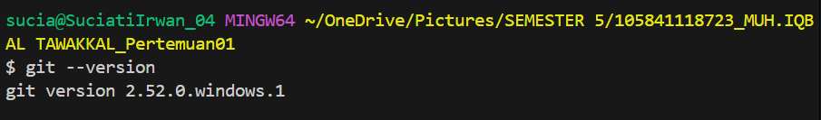
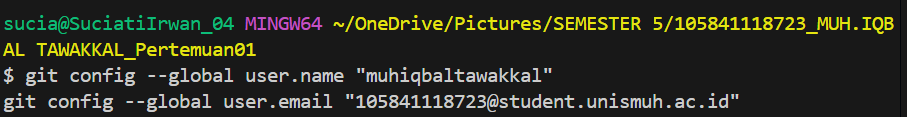
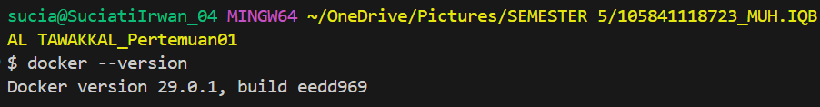
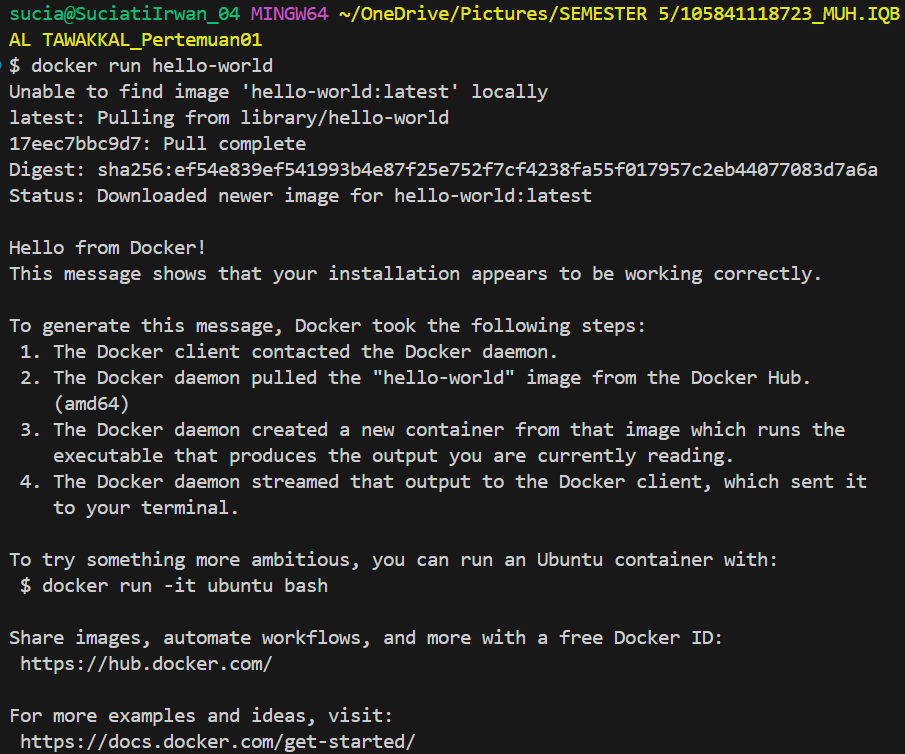
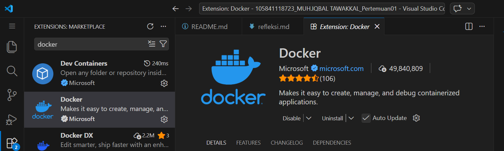
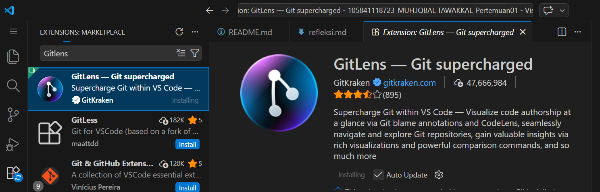
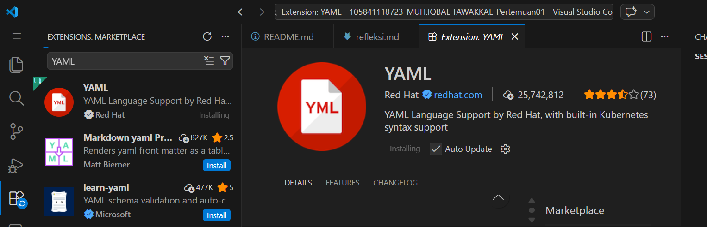
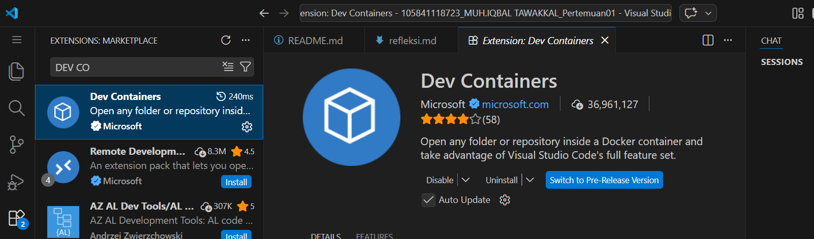

# 🎭 Laporan Praktikum Pertemuan 01
## Pengantar DevOps — Filosofi, Budaya, dan Persiapan Lingkungan
---

## 👤 Identitas Mahasiswa

| Item | Keterangan |
|------|------------|
| **Nama** | MUH.IQBAL TAWAKKAL |
| **NIM** | 105841118723 |
| **Kelas** | 5 A |
| **Tanggal** | 2026-02-27 |
| **Mata Kuliah** | DEVOPS AND CI/CD PIPELINES |
---
Siap 👍 saya tambahkan materi agar lebih kaya, lebih akademik, dan tetap nyambung dengan tulisanmu. Kamu bisa langsung ganti bagian itu dengan versi berikut:

---

## 1. Pemahaman DevOps

### **Apa itu DevOps?**

DevOps (gabungan dari kata *Development* dan *Operations*) pada dasarnya bukanlah sekadar sekumpulan *tools* atau aplikasi, melainkan sebuah filosofi, budaya kerja, dan serangkaian praktik yang bertujuan untuk menyatukan proses pengembangan aplikasi (*Development*) dan operasional TI (*Operations*). Secara tradisional, kedua tim ini sering kali bekerja dalam "silo" atau terpisah; tim pengembang biasanya fokus pada pembuatan fitur baru secepat mungkin, sementara tim operasional fokus pada stabilitas sistem dan keamanan infrastruktur. Perbedaan tujuan ini kerap menimbulkan konflik, keterlambatan rilis, serta kesalahan konfigurasi ketika aplikasi dipindahkan ke lingkungan produksi.

Melalui pendekatan DevOps, dinding pemisah tersebut diruntuhkan. Tim bekerja secara kolaboratif dan berbagi tanggung jawab terhadap kualitas aplikasi, mulai dari tahap perencanaan hingga pemeliharaan. DevOps juga mendorong penerapan otomatisasi dalam proses build, testing, dan deployment melalui konsep Continuous Integration (CI) dan Continuous Delivery/Deployment (CD). Dengan demikian, setiap perubahan kode dapat diuji dan dirilis secara lebih cepat, konsisten, dan terkontrol.

Selain itu, DevOps juga menekankan konsep *Infrastructure as Code (IaC)*, yaitu pengelolaan infrastruktur menggunakan kode yang dapat diversioning seperti halnya aplikasi. Pendekatan ini membuat sistem lebih fleksibel, dapat direplikasi, dan mengurangi kesalahan manual dalam konfigurasi server.

---

### **Mengapa DevOps penting dalam industri saat ini?**

Penerapan DevOps menjadi sangat krusial dalam industri perangkat lunak modern karena tuntutan pasar yang bergerak sangat cepat. Perusahaan harus mampu merilis fitur baru, menambal celah keamanan (*patching*), serta memperbaiki *bug* dengan kecepatan dan keandalan tinggi. Konsumen saat ini mengharapkan pembaruan sistem yang berkelanjutan tanpa mengganggu layanan.

Dengan mengandalkan pilar CALMS (*Culture, Automation, Lean, Measurement, Sharing*), DevOps mengotomatisasi proses yang sebelumnya dilakukan secara manual. Otomatisasi ini meminimalkan kesalahan manusia (*human error*), meningkatkan konsistensi, dan mempercepat waktu rilis (*time-to-market*) dari yang sebelumnya memakan waktu berminggu-minggu atau berbulan-bulan menjadi harian bahkan per jam.

Selain itu, DevOps juga meningkatkan kualitas perangkat lunak melalui praktik *automated testing*, *continuous monitoring*, dan *logging*. Jika terjadi kegagalan sistem di lingkungan produksi, tim dapat dengan cepat mengidentifikasi penyebab masalah dan melakukan pemulihan (*recovery*) secara efisien. Hal ini sangat penting untuk menjaga kepercayaan pengguna dan reputasi perusahaan.

---

### **Perbandingan Pendekatan Tradisional vs DevOps**

| Aspek          | Tradisional     | DevOps                 |
| -------------- | --------------- | ---------------------- |
| Struktur Tim   | Terpisah (Silo) | Terintegrasi           |
| Deployment     | Jarang & Manual | Sering & Otomatis      |
| Feedback       | Lambat          | Cepat & Real-time      |
| Monitoring     | Reaktif         | Proaktif               |
| Tanggung Jawab | Terpisah        | Tanggung jawab bersama |

---

### **Contoh Perusahaan yang Sukses Menerapkan DevOps**

1. **Netflix**
   Netflix merupakan pionir dalam adopsi DevOps dan arsitektur *microservices*. Mereka mengembangkan berbagai *open-source tools* untuk mengotomatisasi infrastruktur *cloud*, sehingga mampu melayani jutaan pengguna secara bersamaan dengan tingkat ketersediaan sistem yang sangat tinggi.

2. **Amazon**
   Amazon bertransisi dari arsitektur *monolithic* ke pendekatan DevOps berbasis *microservices*. Dengan otomatisasi penuh pada proses deployment, Amazon dapat melakukan ribuan deployment setiap hari tanpa mengganggu layanan pelanggan.

3. **Etsy**
   Etsy sebelumnya menghadapi kendala rilis yang lambat dan penuh konflik antar tim. Setelah mengadopsi budaya DevOps, mereka mampu melakukan puluhan deployment setiap hari dengan tingkat *downtime* yang jauh lebih rendah.

## 2. Bukti Instalasi (Screenshots)

Berikut adalah lampiran *screenshot* bukti instalasi *development environment* yang telah dilakukan:

### 2.1 Git Version

### 2.2 Git Config

### 2.3 Docker Version

### 2.4 Docker Hello World

### 2.5 VS Code Extensions

